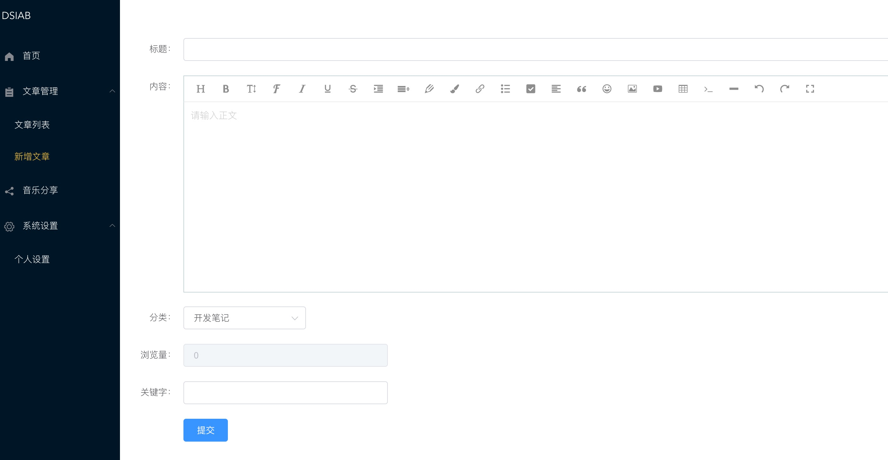
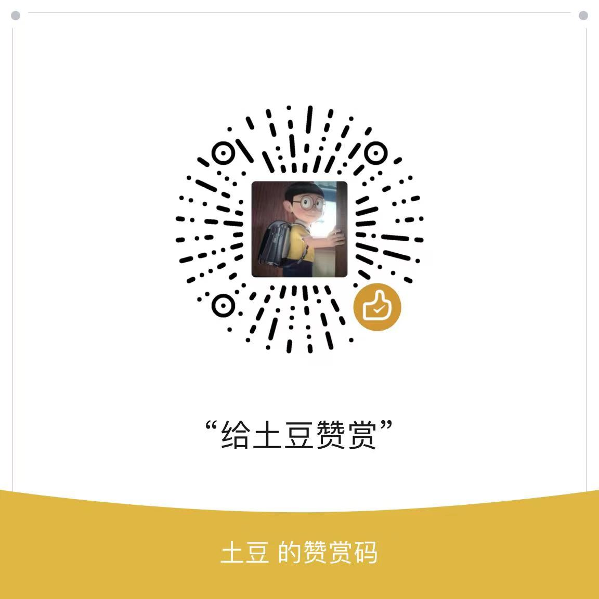

<div><a href="https://gitee.com/wilkwo/vueAdmin/blob/master/README.md">中文</a>  |  <a href="https://gitee.com/wilkwo/vueAdmin/blob/master/README.en.md">ENGLISH</a></div>

<h1 align="center" style=" font-weight: bold;">vueAdmin</h1>
<h5 align="center">Vue-based blog background management system</h5>

### Project Introduction
- Blog background management system based on vue and element-ui

- Main technology: vuejs2.0 + element-ui

- Plugins used: axios + less + wangeditor

- After pulling the code, you can directly see the effect. The default connection is the background management interface of the official website, which can be accessed by using the test account.

### The main function
- Home Kanban: Visit Statistics
- Article management: add, delete, query, modify articles
- Comment management: comment query, delete
- Category management: add and delete categories
- Navigation management: query navigation, classification management, new navigation
- User management: add, delete, modify users
- Personal settings: modification of user personal information
- System settings: site settings, resource management, online compilation, recycle bin
- Common tools: (json formatting, lottery draw, online roll call, image conversion to base64, online generation of QR code, etc., continuously updated...)


### Associated project
- gitee: nuxt-web (https://gitee.com/wilkwo/nuxt-web.git)
  
or

- github: nuxt-web (https://github.com/esplori/vueAdmin.git)

### demo address
- Address: http://admin.dsiab.com

- Test account and password: test/test

### Demo screenshot


### run the project
```
# download code

github: git clone https://github.com/esplori/vueAdmin.git

# install dependencies
npm install

# start the application localhost:8081
npm run dev

# generate application
npm run build

# Build the app and view the report
npm run build --report
```

### Thanks appreciate
Creation is not easy, your appreciation and recognition are the driving force for continuous updating!

