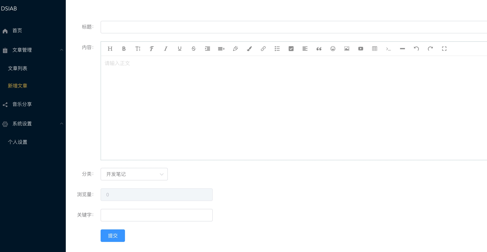

<div><a href="https://gitee.com/wilkwo/vueAdmin/blob/master/README.md">中文</a>  |  <a href="https://gitee.com/wilkwo/vueAdmin/blob/master/README.en.md">english</a></div>


<h1 align="center" style=" font-weight: bold;">vueAdmin</h1>
<h5 align="center">基于vue开发的博客系统</h5>

<p align="center">
	<a href="https://gitee.com/wilkwo/vueAdmin.git"></a>
	<a href="https://gitee.com/wilkwo/vueAdmin.git"></a>
</p>


### 项目介绍

- 基于vue、element-ui实现的的博客后台管理系统

- 主要技术: vuejs2.0 + element-ui

- 使用到的插件： axios + less + wangeditor

- 拉取代码后可直接看到效果，默认连接是官网的后台管理接口，使用测试账号就能进入。

### 主要功能
- 首页看板：访问数据统计
- 文章管理：新增、删除、查询、修改文章
- 评论管理：评论查询、删除
- 分类管理：新增、删除分类
- 导航管理：查询导航、分类管理、新增导航
- 用户管理：新增、删除、修改用户
- 个人设置：用户个人信息修改
- 系统设置：站点设置、资源管理、在线编译、回收站
- 常用工具：（json格式化，抽奖，在线点名，图片转base64，二维码在线生成等，持续更新中...）

### 关联项目

gitee: nuxt-web (https://gitee.com/wilkwo/nuxt-web.git) 

github: nuxt-web (https://github.com/esplori/vueAdmin.git)


### 演示地址

- 地址：http://admin.dsiab.com

- 测试账号、密码： test/test


### 演示截图




### 运行项目

``` bash

#下载代码
gitee: git clone https://gitee.com/wilkwo/vueAdmin.git

或者

github: git clone https://github.com/esplori/vueAdmin.git

# 安装依赖
npm install

# 启动应用 localhost:8081
npm run dev

# 生成应用
npm run build

# 生成应用并查看报告
npm run build --report
```


### 感谢赞赏

创作不易，你的赞赏和认可是持续更新的动力！

